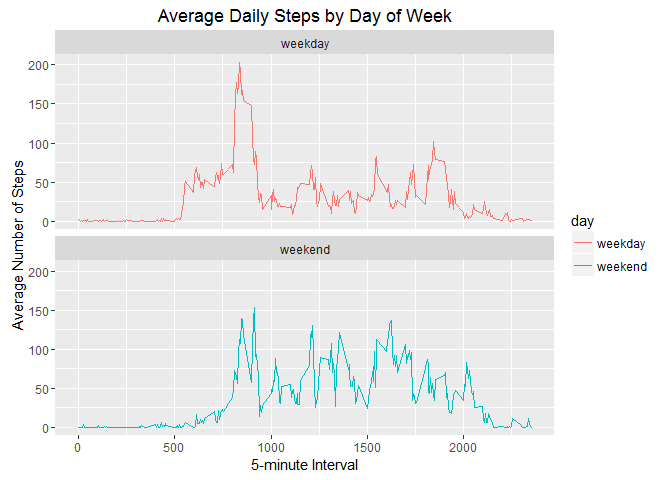

# Reproducible Research: Peer Assessment 1


## Loading and preprocessing the data

```r
unzip(zipfile="activity.zip")

activity <- read.csv("activity.csv", head=TRUE)

library(plyr)
library(ggplot2)
```


## What is mean total number of steps taken per day?

 1. Calculate the total number of steps take per day


```r
total_steps <- tapply(activity$steps, activity$date, sum, na.rm=TRUE)
```

 2. Make a histogram of the total number of steps taken each day.


```r
hist(total_steps, ylab="Count", xlab="Steps",
     main="Total Number of Steps Per Day",
     col="blue", breaks = 20)
```

<!-- -->

 3. Calculate and report the mean and median of the total number of steps


```r
mean_steps <- mean(total_steps)
mean_steps
```

```
## [1] 9354.23
```

```r
med_steps <- median(total_steps)
med_steps
```

```
## [1] 10395
```

## What is the average daily activity pattern?
 1. Make a time series plot (i.e. type = "l") of the 5-minute interval (x-axis) 
 and the average number of steps taken, averaged across all days (y-axis)


```r
avg_steps <- tapply(activity$steps, activity$interval, mean, na.rm=TRUE)

plot(row.names(avg_steps), avg_steps, type="l",
     ylab="Average Number of Steps", xlab="5 minute Intervals",
     main="Average Daily Activity Pattern")
```

<!-- -->

 2. Which 5-minute interval, on average across all the days in the dataset, 
 contains the maximum number of steps?


```r
max_steps <- which.max(avg_steps)
max_steps
```

```
## 835 
## 104
```


## Inputing missing values
1. Calculate and report the total number of missing values 
 in the dataset (i.e. the total number of rows with NAs)


```r
missing <- sum(is.na(activity$steps))
missing
```

```
## [1] 2304
```

2. Devise a strategy for filling in all of the missing 
 values in the dataset. The strategy does not need to be 
 sophisticated. For example, you could use the mean/median 
 for that day, or the mean for that 5-minute interval, etc.

I decided to fill in the NA's of this dataset with "0's".

 3. Create a new dataset that is equal to the original 
 dataset but with the missing data filled in. 


```r
activity2 <- activity
activity2[is.na(activity2$steps),]$steps <- 0
```

 4. Make a histogram of the total number of steps taken 
each day 


```r
total2_steps <- tapply(activity2$steps, activity2$date, sum)
hist(total2_steps, ylab="Count", xlab="Steps",
     main="Total Number of Steps Per Day",
     sub="(NA's changed to 0)",
     col="coral", breaks = 20)
```

<!-- -->

 Calculate and report the mean and median total number of steps taken per day. 


```r
mean2_steps <- mean(total2_steps)
mean2_steps
```

```
## [1] 9354.23
```

```r
med2_steps <- median(total2_steps)
med2_steps
```

```
## [1] 10395
```

Do these values differ from the estimates from the first  part of the assignment?   

No.
 
 
What is the impact of inputing missing data on the estimates of the total daily number of steps?  

The NA's were ignored when creating the first set, so
making them "0's", didn't make a difference.


## Are there differences in activity patterns between weekdays and weekends?
 1. Create a new factor variable in the dataset with two 
    levels – “weekday” and “weekend” indicating whether a 
     given date is a weekday or weekend day.


```r
activity2$date <- as.Date(activity2$date)
activity2$days <- factor(format(activity2$date, "%A"))
levels(activity2$days)
```

```
## [1] "Friday"    "Monday"    "Saturday"  "Sunday"    "Thursday"  "Tuesday"  
## [7] "Wednesday"
```

```r
levels(activity2$days) <- list(weekday = c("Monday", "Tuesday", "Wednesday", 
                                                     "Thursday", "Friday"), weekend = c("Saturday", "Sunday"))
```

 2. Make a panel plot containing a time series plot 
  (i.e. type = "l") of the 5-minute interval (x-axis) and 
   the average number of steps taken, averaged across all 
   weekday days or weekend days (y-axis). 


```r
Interval <- aggregate(activity2$steps, 
    by=list(activity2$days, activity2$interval), mean)
names(Interval) = c("day", "interval", "avg.steps")


g <- ggplot(Interval, aes(interval, avg.steps, color=day))
g + geom_line() + facet_wrap(~day, nrow=2, ncol=1) +
    labs(title = "Average Daily Steps by Day of Week", 
         x = "5-minute Interval", y = "Average Number of Steps") 
```

<!-- -->
